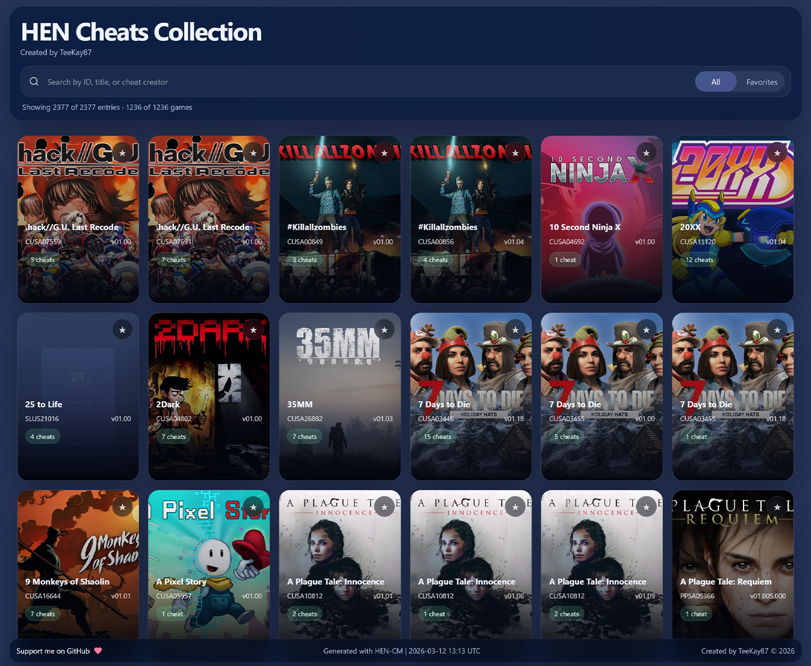

## How to use
1. FTP into your PlayStation
2. Delete, rename or backup the `cheats` folder from `/data/etaHEN/` *(PS5)* or `/user/data/GoldHEN/` *(PS4)*
3. Place the `cheats` folder from my collection in its place

**`IMPORTANT!` Restart and re-jb the PlayStation. Enjoy your brand new cheats**.

## Find compatible cheats
Follow this link to [**OPEN THE HEN CHEATS COLLECTIONS PAGE**](https://raw.githack.com/TeeKay87/HEN-Cheats-Collection/master/list/index.html).
This is an interactive index of all the cheats in my collection.
Search by `ID`, `Title` or `cheat creator`. Mark your games as favorite and filter the list to only show those games.

> Play your way.

## Version History
| Date | Status | ID | Version | Title |
|----|----|----|----|----|
| 2026-02-28 | ADDED | PPSA18259 | 01.000.000 | Dead Rising Deluxe Remaster |
| 2026-02-26 | ADDED | PPSA04609 | 01.017.000 | Elden Ring |
| 2026-02-25 | ADDED | PPSA01284 | 03.000.004 | Returnal |
| 2026-02-23 | ADDED | CUSA54714 | 01.13 | Yakuza Kiwami 3 & Dark Ties |
| 2026-02-21 | ADDED | PPSA15210 | 01.000.000 | DRAGON BALL: Sparking! ZERO |
| 2026-02-21 | ADDED | PPSA15211 | 01.000.000 | DRAGON BALL: Sparking! ZERO |
| 2026-02-19 | ADDED | PPSA09664 | 03.000.000 | Dragon's Dogma 2 |
| 2026-02-11 | ADDED | PPSA01390 | 01.000.000 | Dragon Age™: The Veilguard Deluxe Edition |
| 2026-02-05 | ADDED | PPSA02525 | 01.009.000 | Tormented Souls |

## Notes
### 2026-02-17
Added lots of new cheats.
Added new cheat sources.

Major rework of my HEN Cheats Manager to make it able to merge cheatfiles belonging to same ID/Version combo into a single file. This change will make more cheats available for games that have multiple files from multiple creators as etaHEN only can use one cheat of each file format at a time.

### 2026-02-05
Collection created with new version of my HEN Cheats Manager.

Added `Yharnam` cheats.

Some of the official cheats, and cheats from other sources, are missing tags in their json and xml formatting, and some have other issues. HEN-CM now tries to repair these broken files to hopefully make more cheats work as intended.

As of 2026-02-26, my collection has support for `2364` games and updates, whereas the official etaHEN Cheats repository has cheats for `2130`.

### 2026-01-31
Added the first iteration of the collection containing cheats for 2284 different games and versions
